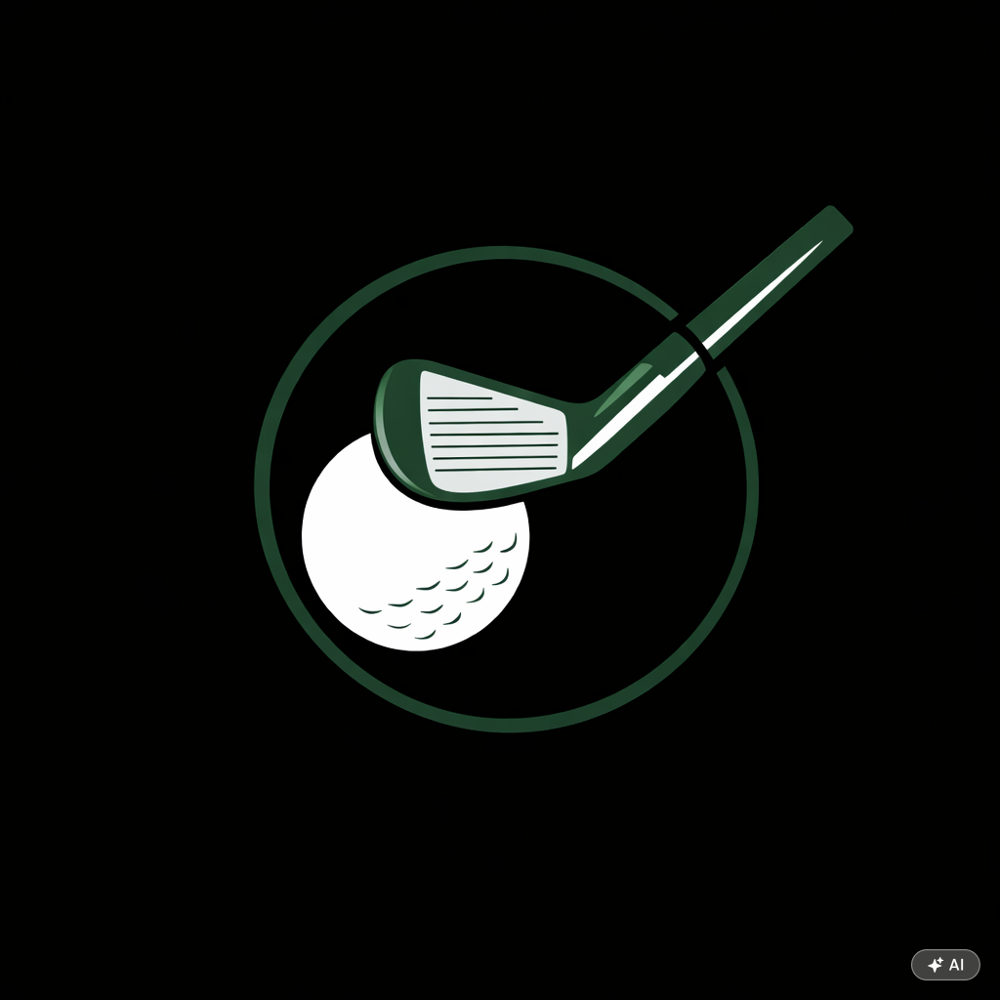

  

<h1 align="center">Golf Club Tracker</h1>

<i>A mobile web app companion for keeping your card during a round of golf: 
Log the club behind every shot or just keep track of your score. One phone keeps the card for the whole group, with Stableford making the scores comparable across HCP and tees.</i>

  

---

## Features

**Two ways to keep your card.**

- Either tracking the club behind every shot, providing the most insights, with **Clubs & Shots**.
- Or alternatively, to only track the totals per hole, with the **Score Only** option.

**Follow a round from anywhere.** In the round summary, tap **Get a live code** to share the
round. Anyone can enter the code (e.g. `GX7-42K`) under **📡 Follow a live round** in the app,
or on the [live view page](https://robert-rjm.github.io/Golf-Club-Tracker/view.html), to see
the scorecard, Stableford points and clubs per hole, updating as the round is played.
Codes stop working 30 days after the last update, or straight away with **Stop sharing**.

## Getting started

Open the [app](https://robert-rjm.github.io/Golf-Club-Tracker/) on your phone. It works in any
mobile browser, but it's nicer added to your home screen, where it opens full screen like an app:

- **iPhone (Safari):** tap **Share → Add to Home Screen**
- **Android (Chrome):** tap **⋮ → Add to Home screen** (or **Install app**)

To play a round, pick your course, the number of holes, your tee and your handicap. On the next
screen, add any playing partners and tap **Start Round**.

Your rounds are saved on your phone only. Clearing your browser's data for the site deletes them.

## Courses

These courses are built in, with the par, stroke index and ratings for every tee, so Stableford
works straight away:

| Course | Holes | Par |
|--------|-------|-----|
| Golfclub St Genis | 9 · 18 | 37 (9 holes) |
| Golfclub St Genis, 5-hole course | 5 | 16 |
| Ugolf Aravella Andorra | 9 · 18 | 71 |
| Grandvalira Golf Soldeu | 9 · 18 | 33 (9 holes) |
| Verbier Les Esserts | 9 · 18 | 69 |

To play the 5-hole course, pick **Golfclub St Genis**, then **5 holes**. Choosing 18 holes on
a 9-hole course plays the nine twice.

### Playing somewhere else

Type the course name into the search box in the lobby, then choose:

- **Play "…" without saving** for a one-off round of 9 or 18 holes. You can set the par for
  each hole if you like.
- **＋ Save "…" as a course** to keep the course on your phone for next time. Enter the par
  and stroke index for each hole from the scorecard. To change it later, tap **✎ Edit** under
  the course buttons.

For Stableford points, the app also needs the course's **Course Rating** (also called SSS) and
**Slope** for your tee. You'll find them on the scorecard or the club's website. Without them
you can still keep shots and scores, just without points.

> On a 9-hole course the scorecard usually shows 18-hole ratings (for example 66.4 and 110).
> Enter those as they are. The app works out the 9-hole figures itself.

### Want your course added for everyone?

Save it with **＋ Save "…" as a course**, as above. That also sends it in to be added to the
app, so there's nothing else to do. If you enter the ratings, say in the note where they came
from (a link to the scorecard is perfect) so they can be checked.

You can also [open an issue](../../issues/new) titled `Course suggestion: [Course Name]`. Include
the par and stroke index of each hole, and the rating and slope for each tee, for men and ladies.

## Running your own copy

The app is a handful of static files with no build step. For the file layout, setting up live
sharing with Supabase, and adding courses to the code, see [docs/DEVELOPMENT.md](docs/DEVELOPMENT.md).

## License

This project is licensed under CC BY-NC-SA 4.0. See [LICENSE](LICENSE) for details.
